# 餐厅管理系统数据库设计文档

## 目录

1. [概述](#概述)
2. [实体关系图](#实体关系图)
3. [数据表详细说明](#数据表详细说明)
   - [customer (客户表)](#customer-客户表)
   - [staff (员工表)](#staff-员工表)
   - [merchant (商户表)](#merchant-商户表)
   - [back_kitchen_order (后厨订单表)](#back_kitchen_order-后厨订单表)
   - [wallet (钱包表)](#wallet-钱包表)
   - [wallet_transaction_record (钱包交易记录表)](#wallet_transaction_record-钱包交易记录表)
   - [dining_table (餐桌表)](#dining_table-餐桌表)
   - [dining_table_type (餐桌类型表)](#dining_table_type-餐桌类型表)
   - [table_reservation (餐桌预约表)](#table_reservation-餐桌预约表)
   - [delivery_address (收货地址表)](#delivery_address-收货地址表)
   - [customer_order (客户订单表)](#customer_order-客户订单表)
   - [drawback_application (退款申请表)](#drawback_application-退款申请表)
   - [drawback_application_image (退款申请照片表)](#drawback_application_image-退款申请照片表)
   - [discounts (优惠表)](#discounts-优惠表)
   - [discount_coupon_customer (客户优惠券表)](#discount_coupon_customer-客户优惠券表)
   - [discount_coupon (优惠券表)](#discount_coupon-优惠券表)
   - [discount_coupon_area_cuisine (优惠券使用范围菜品表)](#discount_coupon_area_cuisine-优惠券使用范围菜品表)
   - [discount_coupon_area_cuisine_type (优惠券使用范围菜品类别表)](#discount_coupon_area_cuisine_type-优惠券使用范围菜品类别表)
   - [customer_order_cuisine (订单菜品列表表)](#customer_order_cuisine-订单菜品列表表)
   - [cuisine (菜品详情表)](#cuisine-菜品详情表)
   - [raw_material (原料表)](#raw_material-原料表)
   - [raw_material_type (原料分类表)](#raw_material_type-原料分类表)
   - [cuisine_image (菜品图片表)](#cuisine_image-菜品图片表)
   - [cuisine_type (菜品类别表)](#cuisine_type-菜品类别表)
   - [style_of_cooking (菜系表)](#style_of_cooking-菜系表)
   - [taste (口味表)](#taste-口味表)
   - [cuisine_component (菜品分量表)](#cuisine_component-菜品分量表)
   - [daily_sales_volume (菜品每日销售数量表)](#daily_sales_volume-菜品每日销售数量表)
   - [evaluate (评价表)](#evaluate-评价表)
   - [evaluate_image (评价图片表)](#evaluate_image-评价图片表)
   - [shop (门店表)](#shop-门店表)
   - [delivery (配送配置表)](#delivery-配送配置表)
   - [area (区域表)](#area-区域表)
   - [province (省表)](#province-省表)
   - [working_schedule (排班表)](#working_schedule-排班表)
   - [staff_login_log (员工登录日志表)](#staff_login_log-员工登录日志表)
   - [printer (打印机表)](#printer-打印机表)
   - [receipt (小票样式管理表)](#receipt-小票样式管理表)

## 概述

本文档详细描述了餐厅管理系统的数据库设计，包括所有数据表的结构、字段说明以及表之间的关系。该数据库设计支持完整的餐厅业务流程，包括客户管理、员工管理、订单处理、支付管理、库存管理等功能。

## 实体关系图

```mermaid
erDiagram
    %% 核心实体关系
    customer ||--o{ customer_order : places
    customer ||--o{ table_reservation : makes
    customer ||--o{ discount_coupon_customer : has
    customer ||--|| wallet : owns
    customer ||--o{ delivery_address : has
    customer ||--|| shop : registered_at
    
    staff ||--o{ customer_order : serves
    staff ||--o{ table_reservation : handles
    staff ||--o{ discount_coupon_customer : issues
    staff ||--o{ drawback_application : processes
    staff ||--o{ staff_login_log : logs
    staff ||--o{ working_schedule : has
    staff ||--|| shop : works_at
    
    merchant ||--o{ shop : owns
    
    shop ||--o{ dining_table : contains
    shop ||--o{ printer : has
    shop ||--o{ discount_coupon : issues
    shop ||--o{ cuisine : sells
    shop ||--o{ raw_material : stocks
    shop ||--|| delivery : configures
    shop ||--|| area : located_in
    
    area ||--|| province : belongs_to
    
    %% 订单相关关系
    customer_order ||--o{ back_kitchen_order : generates
    customer_order ||--o{ customer_order_cuisine : contains
    customer_order ||--o{ discounts : has
    customer_order ||--o{ evaluate : receives
    customer_order ||--|| dining_table : assigned_to
    customer_order ||--|| delivery_address : delivered_to
    customer_order ||--|| discount_coupon_customer : uses
    
    %% 退款相关关系
    drawback_application ||--o{ drawback_application_image : has
    
    %% 优惠券相关关系
    discount_coupon ||--o{ discount_coupon_customer : distributed_to
    discount_coupon ||--o{ discount_coupon_area_cuisine : applies_to
    discount_coupon ||--o{ discount_coupon_area_cuisine_type : applies_to
    
    %% 餐桌相关关系
    dining_table ||--|| dining_table_type : classified_as
    table_reservation ||--|| dining_table_type : requests
    
    %% 钱包相关关系
    wallet ||--o{ wallet_transaction_record : records
    
    %% 菜品相关关系
    cuisine ||--o{ customer_order_cuisine : ordered_as
    cuisine ||--o{ cuisine_image : has
    cuisine ||--|| cuisine_type : classified_as
    cuisine ||--|| style_of_cooking : belongs_to
    cuisine ||--|| taste : has
    cuisine ||--|| cuisine_component : measured_by
    cuisine ||--o{ daily_sales_volume : tracked_as
    cuisine ||--o{ discount_coupon_area_cuisine : included_in
    
    %% 原料相关关系
    raw_material ||--|| raw_material_type : classified_as
    
    %% 菜品类型与优惠券关系
    cuisine_type ||--o{ discount_coupon_area_cuisine_type : included_in
    
    %% 评价相关关系
    evaluate ||--o{ evaluate_image : has
    
    %% 其他关系
    delivery ||--|| shop : configures
    discount_coupon_area_cuisine ||--|| cuisine : includes
    discount_coupon_area_cuisine_type ||--|| cuisine_type : includes
    customer_order_cuisine ||--|| cuisine : contains
    daily_sales_volume ||--|| cuisine : tracks
    cuisine_image ||--|| cuisine : displays
    cuisine_component ||--o{ cuisine : defines
    taste ||--o{ cuisine : describes
    style_of_cooking ||--o{ cuisine : categorizes
    raw_material_type ||--o{ raw_material : groups
    printer ||--|| shop : belongs
    working_schedule ||--|| staff : schedules
    staff_login_log ||--|| staff : logs
    receipt ||--o{ shop : configures
    province ||--o{ area : contains
```

## 数据表详细说明

### customer (客户表)

| 字段名              | 数据类型     | 允许空 | 默认值 | 说明                                     |
| ------------------- | ------------ | ------ | ------ | ---------------------------------------- |
| customer_id         | char(32)     | 否     |        | 客户id                                   |
| integral            | longblob     | 是     |        | 积分                                     |
| wallet_id           | char(32)     | 是     |        | 客户对应的钱包                           |
| head_portrait       | text         | 是     |        | 头像                                     |
| account             | varchar(255) | 是     |        | 账号                                     |
| password            | varchar(255) | 是     |        | 密码                                     |
| level               | int          | 是     | 0      | 会员等级(0：青铜、1：白银、2：黄金...)   |
| consumption_plance  | double(10,2) | 是     | 0      | 消费总额(可用根据这个消费升级会员等级)   |
| consumption_num     | longblob     | 是     |        | 消费的总次数                             |
| delivery_address_id | char(32)     | 是     |        | 默认的收货地址                           |
| phone               | char(11)     | 是     |        | 绑定的手机号                             |
| sex                 | int          | 是     | 0      | 性别(0：男、1：女、2：保密)              |
| birthday            | date         | 是     |        | 用户的生日                               |
| create_time         | datetime     | 是     |        | 创建时间                                 |
| shop_id             | char(32)     | 是     |        | 创建的门店，可用这个来区分门店的新人绩效 |

### staff (员工表)

| 字段名   | 数据类型     | 允许空 | 默认值 | 说明                                                         |
| -------- | ------------ | ------ | ------ | ------------------------------------------------------------ |
| staff_id | char(32)     | 否     |        | 员工id                                                       |
| name     | varchar(20)  | 是     |        | 员工姓名                                                     |
| account  | varchar(255) | 是     |        | 员工账号                                                     |
| phone    | char(11)     | 是     |        | 手机号                                                       |
| password | varchar(30)  | 是     |        | 密码                                                         |
| perssion | int          | 是     |        | 账号对应的权限，比如店长就可以登录多个端(0：后厨、1：服务、2：店长、3：收银) |
| job_num  | varchar(10)  | 是     |        | 员工的工号 (0001)                                            |
| type     | int          | 是     |        | 职务(0：店长、1：收银、2：主厨、3、保洁、4：服务员、5：主厨助理、6：切菜员、7：传菜员) |
| shop_id  | char(32)     | 是     |        | 员工所属的门店                                               |
| state    | int          | 是     | 0      | 员工的状态(0：在职，1：离职)                                 |

### merchant (商户表)

| 字段名      | 数据类型    | 允许空 | 默认值 | 说明           |
| ----------- | ----------- | ------ | ------ | -------------- |
| merchant_id | char(32)    | 否     |        | 商户id         |
| account     | varchar(30) | 是     |        | 商户的账号     |
| password    | varchar(30) | 是     |        | 商户账号的密码 |

### back_kitchen_order (后厨订单表)

| 字段名                | 数据类型 | 允许空 | 默认值 | 说明                                     |
| --------------------- | -------- | ------ | ------ | ---------------------------------------- |
| back_kitchen_order_id | char(32) | 否     |        |                                          |
| customer_order_id     | char(40) | 是     |        | 对应的客户订单，其中包含了订单的所有数据 |
| create_time           | datetime | 是     |        | 创建时间（这个时间决定后厨是否该出餐）   |

### wallet (钱包表)

| 字段名       | 数据类型     | 允许空 | 默认值 | 说明                      |
| ------------ | ------------ | ------ | ------ | ------------------------- |
| wallet_id    | char(32)     | 否     |        |                           |
| balance      | double(10,2) | 是     |        | 余额                      |
| pay_password | char(32)     | 是     |        | 支付密码，使用MD5加盐加密 |

### wallet_transaction_record (钱包交易记录表)

| 字段名                       | 数据类型     | 允许空 | 默认值 | 说明                                                         |
| ---------------------------- | ------------ | ------ | ------ | ------------------------------------------------------------ |
| wallet_transaction_record_id | char(32)     | 否     |        |                                                              |
| wallet_id                    | char(32)     | 是     |        | 交易记录对应的钱包                                           |
| type                         | int          | 是     | 0      | 交易类型(0：储值、1：消费)                                   |
| balance                      | double(10,2) | 是     |        | 交易金额                                                     |
| record_fun                   | int          | 是     |        | 交易方式，后面两个是消费时的(0：支付宝支付、1：微信支付、2：现金支付、3：银行卡、0：外卖、1：门店) |

### dining_table (餐桌表)

| 字段名               | 数据类型 | 允许空 | 默认值 | 说明                                                         |
| -------------------- | -------- | ------ | ------ | ------------------------------------------------------------ |
| dining_table_id      | char(32) | 否     |        |                                                              |
| serial_number        | text     | 是     |        | 编号（1F 10010号）                                           |
| dining_table_type_id | char(32) | 是     |        | 餐桌的类型                                                   |
| user_state           | int      | 是     |        | 餐桌的状态(0：空闲、1：待点菜、2：预结账、3：用餐中)         |
| shop_id              | char(32) | 是     |        | 所属的门店                                                   |
| state                | int      | 是     | 0      | 启用状态(0：启用、1：停用)                                   |
| qr_code              | text     | 是     |        | 台桌点餐的二维码，生成后这里存储url，或者可用尝试其他类型的数据 |

### dining_table_type (餐桌类型表)

| 字段名               | 数据类型 | 允许空 | 默认值 | 说明                                |
| -------------------- | -------- | ------ | ------ | ----------------------------------- |
| dining_table_type_id | char(32) | 否     |        |                                     |
| type                 | int      | 是     |        | 桌位类型(0：小桌、1：大桌、2：包间) |
| max                  | int      | 是     |        | 最多人数                            |
| min                  | int      | 是     |        | 最少人数                            |

### table_reservation (餐桌预约表)

| 字段名               | 数据类型     | 允许空 | 默认值 | 说明                                      |
| -------------------- | ------------ | ------ | ------ | ----------------------------------------- |
| table_reservation_id | char(32)     | 否     |        |                                           |
| shop_id              | char(32)     | 是     |        | 预约对应的门店                            |
| customer_id          | char(32)     | 是     |        | 预约的客户                                |
| staff_id             | char(32)     | 是     |        | 预约的员工(客户通过电话直接预约的)        |
| reservation_date     | date         | 是     |        | 预约日期                                  |
| reservation_time     | date         | 是     |        | 预约时间                                  |
| dining_table_type_id | char(32)     | 是     |        | 预约的餐桌类型                            |
| people_num           | int          | 是     |        | 就餐人数                                  |
| table_num            | int          | 是     |        | 预订餐桌数                                |
| name                 | varchar(255) | 是     |        | 联系人                                    |
| phone                | char(11)     | 是     |        | 手机号                                    |
| remake               | text         | 是     |        | 备注                                      |
| state                | int          | 是     |        | 预约状态：0：待确认、1：已完成、2：已取消 |
| create_time          | datetime     | 是     |        | 预约的创建时间                            |

### delivery_address (收货地址表)

| 字段名              | 数据类型     | 允许空 | 默认值 | 说明           |
| ------------------- | ------------ | ------ | ------ | -------------- |
| delivery_address_id | char(32)     | 否     |        |                |
| name                | varchar(255) | 是     |        | 收货人姓名     |
| phone               | char(11)     | 是     |        | 联系电话       |
| address             | text         | 是     |        | 地址详细       |
| create_time         | datetime     | 是     |        | 地址的创建时间 |

### customer_order (客户订单表)

| 字段名                      | 数据类型     | 允许空 | 默认值 | 说明                                                         |
| --------------------------- | ------------ | ------ | ------ | ------------------------------------------------------------ |
| customer_order_id           | char(40)     | 是     |        | 订单id yyyyMMdd+UUID32                                       |
| customer_id                 | char(32)     | 是     |        | 客户id                                                       |
| staff_id                    | char(32)     | 是     |        | 如果是服务员点的就需要这个id                                 |
| all_price                   | double(10,2) | 是     |        | 订单总额                                                     |
| state                       | int          | 是     | 0      | 订单状态(0：待付款、1：待收取、2：已完成、3：已取消、4：待评价、5：未处理、6：已接单、7：已拒绝、8：已送达、9：已自提、10：已作废、11：已退款) |
| packing_charges             | double(10,2) | 是     |        | 打包费                                                       |
| delivery_cost               | double(10,2) | 是     |        | 配送费                                                       |
| discount_coupon_customer_id | char(32)     | 是     |        | 使用的优惠券                                                 |
| tableware_num               | int          | 是     |        | 餐具数量                                                     |
| remark                      | text         | 是     |        | 备注                                                         |
| create_time                 | datetime     | 是     |        | 创建时间                                                     |
| pay_time                    | datetime     | 是     |        | 支付时间                                                     |
| source                      | int          | 是     |        | 订单来源(0：门店、1：线上)                                   |
| type                        | int          | 是     | 0      | 订单类型(0：堂食、1：外卖、2：自取)                          |
| dining_table_id             | char(32)     | 是     |        |                                                              |
| delivery_address_id         | char(32)     | 是     |        |                                                              |
| pay_type                    | int          | 是     | 0      | 支付方式(0：微信支付、1：支付宝支付、2：现金支付、3：银行卡支付、4：会员卡支付) |
| delete                      | int          | 是     | 0      | 是否被用户删除(0：未删除、1：已删除)                         |

### drawback_application (退款申请表)

| 字段名            | 数据类型     | 允许空 | 默认值 | 说明                                        |
| ----------------- | ------------ | ------ | ------ | ------------------------------------------- |
| customer_order_id | char(40)     | 是     |        | 被退款的订单                                |
| state             | int          | 是     |        | 申请的状态(0：未处理、1：已驳回、2：已处理) |
| drawback_reason   | text         | 是     |        | 退款的原因                                  |
| rejeck_reason     | text         | 是     |        | 驳回的原因                                  |
| balance           | double(10,2) | 是     |        | 退款的金额，理论不能超过订单                |
| staff_id          | char(32)     | 是     |        | 处理人                                      |

### drawback_application_image (退款申请照片表)

| 字段名            | 数据类型 | 允许空 | 默认值 | 说明         |
| ----------------- | -------- | ------ | ------ | ------------ |
| customer_order_id | char(40) | 是     |        | 被退款的订单 |
| url               | text     | 是     |        | 图片的连接   |
| show_order        | int      | 是     |        | 展示的排序   |

### discounts (优惠表)

| 字段名            | 数据类型     | 允许空 | 默认值 | 说明                                                   |
| ----------------- | ------------ | ------ | ------ | ------------------------------------------------------ |
| customer_order_id | char(40)     | 是     |        | 优惠的客户订单                                         |
| type              | int          | 是     | 1      | 优惠的方式(0：打折、1：免单、2：会员优惠、3：满减优惠) |
| num               | double(10,2) | 是     | 0      | 折扣值:(0-10)，如果免单就填0                           |
| balance           | double(10,2) | 是     |        | 优惠的金额                                             |
| content           | text         | 是     |        | 优惠原因                                               |

### discount_coupon_customer (客户优惠券表)

| 字段名                      | 数据类型 | 允许空 | 默认值 | 说明                                                         |
| --------------------------- | -------- | ------ | ------ | ------------------------------------------------------------ |
| discount_coupon_customer_id | char(32) | 是     |        | 一个客户可能有多个同总的优惠券，使用的时候不能直接使用优惠券的发行id |
| customer_id                 | char(32) | 是     |        | 所属的客户                                                   |
| staff_id                    | char(32) | 是     |        | 如果是堂食收银收的，如果要使用就需要这个id                   |
| discount_coupon_id          | char(32) | 是     |        | 对应的优惠券                                                 |
| get_time                    | datetime | 是     |        | 客户获取优惠券的时间                                         |
| use_time                    | datetime | 是     |        | 优惠券的使用时间                                             |
| state                       | int      | 是     |        | 优惠券状态(0：未使用、1：已使用、2：已过期)                  |

### discount_coupon (优惠券表)

| 字段名             | 数据类型     | 允许空 | 默认值 | 说明                                                  |
| ------------------ | ------------ | ------ | ------ | ----------------------------------------------------- |
| discount_coupon_id | char(32)     | 否     |        |                                                       |
| start_time         | datetime     | 是     |        | 有效期开始时间                                        |
| end_time           | datetime     | 是     |        | 有效期结束时间                                        |
| name               | text         | 是     |        | 优惠券的名称                                          |
| type               | int          | 是     |        | 优惠券的类型(0：满减券、1：折扣券)                    |
| price              | double(10,2) | 是     |        | 优惠券金额                                            |
| discount           | double(10,2) | 是     |        | 优惠的折扣数(0-10)                                    |
| condition          | double(10,2) | 是     |        | 满多少可用使用的门槛                                  |
| grant_num          | longblob     | 是     |        | 发放的数量                                            |
| surplus_num        | longblob     | 是     |        | 剩余的数量                                            |
| use_num            | longblob     | 是     |        | 优惠券的使用量，有些可能领取了但是没有被使用          |
| astrict_num        | longblob     | 是     |        | 每人限制领取的数量                                    |
| shop_id            | char(32)     | 是     |        | 所属的门店                                            |
| use_area           | int          | 是     |        | 可用使用的范围(0：全部菜品、1：指定菜品、3：指定分类) |

### discount_coupon_area_cuisine (优惠券使用范围菜品表)

| 字段名             | 数据类型 | 允许空 | 默认值 | 说明         |
| ------------------ | -------- | ------ | ------ | ------------ |
| discount_coupon_id | char(32) | 是     |        | 所属的优惠券 |
| cuisine_id         | char(32) | 是     |        | 对应的菜品   |
| show_order         | int      | 是     |        | 展示时的排序 |

### discount_coupon_area_cuisine_type (优惠券使用范围菜品类别表)

| 字段名             | 数据类型 | 允许空 | 默认값 | 说明           |
| ------------------ | -------- | ------ | ------ | -------------- |
| discount_coupon_id | char(32) | 是     |        | 所属的优惠券   |
| cuisine_type_id    | char(32) | 是     |        | 对应的菜品类别 |
| show_order         | int      | 是     |        | 展示时的排序   |

### customer_order_cuisine (订单菜品列表表)

| 字段名            | 数据类型 | 允许空 | 默认값 | 说明           |
| ----------------- | -------- | ------ | ------ | -------------- |
| customer_order_id | char(40) | 是     |        | 客户订单id     |
| cuisine_id        | char(32) | 是     |        |                |
| num               | int      | 是     |        | 当前菜品的数量 |
| cuisine_order     | int      | 是     |        | 菜品的排序     |

### cuisine (菜品详情表)

| 字段名               | 数据类型     | 允许空 | 默认값 | 说明                                |
| -------------------- | ------------ | ------ | ------ | ----------------------------------- |
| cuisine_id           | char(32)     | 否     |        |                                     |
| name                 | varchar(255) | 是     |        | 菜品的名称                          |
| num                  | varchar(10)  | 是     |        | 编号，用于方便每个门店进行记忆(001) |
| price                | double(10,2) | 是     |        | 价格                                |
| creation_method      | text         | 是     |        | 制作方法                            |
| meat_vegetable       | text         | 是     |        | 荤素                                |
| main_ingredient      | text         | 是     |        | 主料                                |
| ingredients          | text         | 是     |        | 辅料                                |
| style_of_cooking_id  | char(32)     | 是     |        | 对应的菜系                          |
| cuisine_component_id | char(32)     | 是     |        | 对应的规格                          |
| cuisine_type_id      | char(32)     | 是     |        | 菜品对应的分类                      |
| shop_id              | char(32)     | 是     |        | 该菜品对应的门店                    |
| state                | int          | 是     | 0      | 菜品的出售状态(0：在售、1：停售)    |
| is_special_offer     | int          | 是     | 0      | 是否特价(0：否、1：是)              |
| special_offer        | double(10,2) | 是     |        | 特价价格                            |
| taste_id             | char(32)     | 是     |        | 菜品对应的口味                      |
| min_num              | int          | 是     | 1      | 起卖的数量                          |
| inventory            | longblob     | 是     |        | 库存数量                            |
| introduce            | text         | 是     |        | 菜品的介绍                          |
| take_out_show        | int          | 是     | 0      | 是否外卖展示(0：是、1：否)          |
| dine_in_show         | int          | 是     | 0      | 是否堂食展示(0：是、1：否)          |
| warning_min          | longblob     | 是     |        | 库存过低预警数量                    |
| warning_max          | longblob     | 是     |        | 库存过高预警数量                    |

### raw_material (原料表)

| 字段名               | 数据类型    | 允许空 | 默认값 | 说明             |
| -------------------- | ----------- | ------ | ------ | ---------------- |
| raw_material_id      | char(32)    | 否     |        |                  |
| raw_material_type_id | char(32)    | 是     |        | 原料对应的分类   |
| name                 | text        | 是     |        | 原料的名称       |
| shop_id              | char(32)    | 是     |        | 所属的门店       |
| num                  | varchar(10) | 是     |        | 序号(0001)       |
| remark               | text        | 是     |        | 备注             |
| inventory            | longblob    | 是     |        | 库存数量         |
| warning_min          | longblob    | 是     |        | 库存过低预警数量 |
| warning_max          | longblob    | 是     |        | 库存过高预警数量 |

### raw_material_type (原料分类表)

| 字段名               | 数据类型    | 允许空 | 默认값 | 说明       |
| -------------------- | ----------- | ------ | ------ | ---------- |
| raw_material_type_id | char(32)    | 否     |        |            |
| name                 | varchar(30) | 是     |        | 分类的名称 |
| num                  | varchar(10) | 是     |        | 序号(0001) |
| remark               | text        | 是     |        | 备注       |

### cuisine_image (菜品图片表)

| 字段名      | 数据类型 | 允许空 | 默认값 | 说明       |
| ----------- | -------- | ------ | ------ | ---------- |
| cuisine_id  | char(32) | 否     |        |            |
| image       | text     | 是     |        | 图片的url  |
| image_order | int      | 是     |        | 图片的排序 |

### cuisine_type (菜品类别表)

| 字段名          | 数据类型    | 允许空 | 默认값 | 说明                        |
| --------------- | ----------- | ------ | ------ | --------------------------- |
| cuisine_type_id | char(32)    | 否     |        |                             |
| name            | varchar(30) | 是     |        | 分类的名称(招牌菜、热菜...) |
| num             | varchar(10) | 是     |        | 序号(0001)                  |
| remark          | text        | 是     |        | 备注                        |

### style_of_cooking (菜系表)

| 字段名              | 数据类型    | 允许空 | 默认값 | 说明       |
| ------------------- | ----------- | ------ | ------ | ---------- |
| style_of_cooking_id | char(32)    | 否     |        |            |
| name                | varchar(20) | 是     |        | 菜系的名字 |

### taste (口味表)

| 字段名   | 数据类型    | 允许空 | 默认값 | 说明       |
| -------- | ----------- | ------ | ------ | ---------- |
| taste_id | char(32)    | 否     |        |            |
| name     | varchar(30) | 是     |        | 口味的名字 |
| num      | varchar(10) | 是     |        | 序号(0001) |
| remark   | text        | 是     |        | 备注       |

### cuisine_component (菜品分量表)

| 字段名               | 数据类型    | 允许空 | 默认값 | 说明       |
| -------------------- | ----------- | ------ | ------ | ---------- |
| cuisine_component_id | char(32)    | 否     |        |            |
| name                 | varchar(30) | 是     |        | 分量的名字 |
| num                  | varchar(10) | 是     |        | 序号(0001) |
| remark               | text        | 是     |        | 备注       |

### daily_sales_volume (菜品每日销售数量表)

| 字段名     | 数据类型 | 允许空 | 默认값 | 说明           |
| ---------- | -------- | ------ | ------ | -------------- |
| cuisine_id | char(32) | 是     |        | 对应的菜品     |
| sales_date | date     | 是     |        | 销售的日期     |
| num        | longblob | 是     |        | 每日的销售数量 |

### evaluate (评价表)

| 字段名            | 数据类型 | 允许空 | 默认값 | 说明                  |
| ----------------- | -------- | ------ | ------ | --------------------- |
| evaluate_id       | char(32) | 否     |        |                       |
| customer_order_id | char(40) | 是     |        | 客户订单id            |
| score             | int      | 是     |        | 评价分数(1-5)对应星数 |
| content           | text     | 是     |        | 评价的内容            |
| time              | datetime | 是     |        | 评价的时间            |

### evaluate_image (评价图片表)

| 字段名      | 数据类型 | 允许空 | 默认값 | 说明       |
| ----------- | -------- | ------ | ------ | ---------- |
| evaluate_id | char(32) | 否     |        |            |
| url         | text     | 是     |        | 图片连接   |
| image_order | int      | 是     |        | 图片的排序 |

### shop (门店表)

| 字段名              | 数据类型    | 允许空 | 默认值 | 说明                             |
| ------------------- | ----------- | ------ | ------ | -------------------------------- |
| shop_id             | char(32)    | 否     |        |                                  |
| shop_order          | varchar(10) | 是     |        | 门店的排序，也可以是编号 (001)   |
| area_id             | char(32)    | 是     |        |                                  |
| address             | text        | 是     |        | 详细的地址                       |
| phone               | text        | 是     |        | 门店的固定电话                   |
| create_date         | date        | 是     |        | 创建的日期                       |
| people_num          | int         | 是     |        | 门店的人数                       |
| state               | int         | 是     |        | 门店的状态(0：正常、1：关闭)     |
| is_dine_in          | int         | 是     | 0      | 是否提供堂食的服务(0：是、1：否) |
| is_take_out         | int         | 是     | 0      | 是否提供外卖的服务(0：是、1：否) |
| opening_hours_start | time        | 是     |        | 营业开始时间                     |
| opening_hours_end   | time        | 是     |        | 营业结束时间                     |

### delivery (配送配置表)

| 字段名                   | 数据类型     | 允许空 | 默认值 | 说明                                               |
| ------------------------ | ------------ | ------ | ------ | -------------------------------------------------- |
| shop_id                  | char(32)     | 是     |        | 对应的门店                                         |
| delivery_time_start      | time         | 是     |        | 外卖/自提时间开始                                  |
| delivery_time_end        | time         | 是     |        | 外卖/自提时间结束                                  |
| is_full_free_delivery    | int          | 是     |        | 是否开始满免配送费                                 |
| full_free_delivery_price | double(10,2) | 是     |        | 满多少元免费配送                                   |
| payment_method           | int          | 是     |        | 配送费收取方式(0：固定区域收费、1：按距离阶梯收费) |
| area                     | double(10,1) | 是     |        | 设置区域半径                                       |
| area_delivery_price      | double(10,2) | 是     |        | 设置区域固定费用                                   |
| distance_start_num       | double(10,1) | 是     |        | 初始收费公里数                                     |
| distance_start_price     | double(10,2) | 是     |        | 初始收费公价格                                     |
| distance_add_num         | double(10,1) | 是     |        | 每增加的公里数                                     |
| distance_add_price       | double(10,2) | 是     |        | 每次增加的费用                                     |

### area (区域表)

| 字段名      | 数据类型 | 允许空 | 默认값 | 说明       |
| ----------- | -------- | ------ | ------ | ---------- |
| area_id     | char(32) | 否     |        |            |
| name        | text     | 是     |        | 区域的名字 |
| province_id | char(32) | 是     |        | 所属的省   |

### province (省表)

| 字段名      | 数据类型 | 允许空 | 默认값 | 说明     |
| ----------- | -------- | ------ | ------ | -------- |
| province_id | char(32) | 否     |        |          |
| name        | text     | 是     |        | 省的名字 |

### working_schedule (排班表)

| 字段名       | 数据类型 | 允许空 | 默认값 | 说明                                |
| ------------ | -------- | ------ | ------ | ----------------------------------- |
| staff_id     | char(32) | 是     |        | 排班对应的员工                      |
| working_date | date     | 是     |        | 日期                                |
| type         | int      | 是     |        | 排班的类型(0：早班、1：晚班、2：休) |

### staff_login_log (员工登录日志表)

| 字段名     | 数据类型    | 允许空 | 默认값 | 说明         |
| ---------- | ----------- | ------ | ------ | ------------ |
| staff_id   | char(32)    | 是     |        | 对应的员工   |
| login_time | datetime    | 是     |        | 登录时间     |
| quit_time  | datetime    | 是     |        | 退出时间     |
| login_ip   | varchar(15) | 是     |        | 登录的ip地址 |

### printer (打印机表)

| 字段名                | 数据类型    | 允许空 | 默认값 | 说明                                                   |
| --------------------- | ----------- | ------ | ------ | ------------------------------------------------------ |
| printer_id            | char(32)    | 否     |        |                                                        |
| num                   | varchar(10) | 是     |        | 打印机的编号 (00001)                                   |
| name                  | varchar(30) | 是     |        | 设备的名称 (惠普DJ2720)                                |
| type                  | int         | 是     | 0      | 打印机的类型(0：云打印机、1：网口打印机、2：USB打印机) |
| receipt_type          | int         | 是     | 0      | 小票类型(0：普通小票、1：标签小票)                     |
| brand                 | varchar(30) | 是     |        | 设备的品牌                                             |
| sn_num                | text        | 是     |        | 设备的SN号                                             |
| printer_key           | text        | 是     |        | 设备key                                                |
| receipt_specification | int         | 是     |        | 设备规格(0：80mm、1：58mm)                             |
| shop_id               | char(32)    | 是     |        | 打印机所属的门店                                       |
| state                 | int         | 是     | 0      | 状态(0：可用、1：不可用)                               |

### receipt (小票样式管理表)

| 字段名                         | 数据类型 | 允许空 | 默认값 | 说明                                                         |
| ------------------------------ | -------- | ------ | ------ | ------------------------------------------------------------ |
| type                           | int      | 是     |        | 小票的类型(0：堂食小票、1：外卖小票、2：后厨小票、3：充值小票) |
| shop_name                      | int      | 是     |        | 门店名称(0：不显示、1显示)---可用的小票类型(013)             |
| title_welecome                 | int      | 是     |        | 头部欢迎语(0：不显示、1显示)---可用的小票类型(013)           |
| title_welecome_word            | text     | 是     |        | 头部欢迎内容                                                 |
| receipt_type                   | int      | 是     |        | 票据类型(0：不显示、1显示)---可用的小票类型(0123)            |
| table_num                      | int      | 是     |        | 桌号/取餐号(0：不显示、1显示)---可用的小票类型(02)           |
| people_num                     | int      | 是     |        | 人数(0：不显示、1显示)---可用的小票类型(0)                   |
| oreder_num                     | int      | 是     |        | 订单编号(0：不显示、1显示)---可用的小票类型(0123)            |
| oreder_create_time             | int      | 是     |        | 下单时间(0：不显示、1显示)---可用的小票类型(012)             |
| cuisine_detail                 | int      | 是     |        | 菜品详情(0：不显示、1显示)---可用的小票类型(012)             |
| remark                         | int      | 是     |        | 备注(0：不显示、1显示)---可用的小票类型(02)                  |
| pay_detail                     | int      | 是     |        | 支付详情(0：不显示、1显示)---可用的小票类型(01)              |
| discount_detail                | int      | 是     |        | 优惠详情(0：不显示、1显示)---可用的小票类型(01)              |
| shop_address                   | int      | 是     |        | 门店地址(0：不显示、1显示)---可用的小票类型(013)             |
| shop_phone                     | int      | 是     |        | 门店电话(0：不显示、1显示)---可用的小票类型(013)             |
| wechat_public_account_qr_code  | int      | 是     |        | 公众号二维码(0：不显示、1显示)---可用的小票类型(013)         |
| mini_program_qr_code           | int      | 是     |        | 小程序二维码(0：不显示、1显示)---可用的小票类型(013)         |
| closing_remarks_gratitude      | int      | 是     |        | 结束致谢语(0：不显示、1显示)---可用的小票类型(01)            |
| closing_remarks_gratitude_word | int      | 是     |        | 结束致谢语内容                                               |
| customer_name                  | int      | 是     |        | 顾客姓名(0：不显示、1显示)---可用的小票类型(13)              |
| customer_phone                 | int      | 是     |        | 顾客手机号(0：不显示、1显示)---可用的小票类型(13)            |
| customer_address               | int      | 是     |        | 配送地址(0：不显示、1显示)---可用的小票类型(1)               |
| take_out_time                  | int      | 是     |        | 配送时间/自提时间(0：不显示、1显示)---可用的小票类型(12)     |
| food_container_cost            | int      | 是     |        | 餐盒费(0：不显示、1显示)---可用的小票类型(1)                 |
| delivery_cost                  | int      | 是     |        | 配送费(0：不显示、1显示)---可用的小票类型(1)                 |
| recharge_time                  | int      | 是     |        | 充值时间(0：不显示、1显示)---可用的小票类型(3)               |
| recharge_detail                | int      | 是     |        | 充值详情(0：不显示、1显示)---可用的小票类型(3)               |